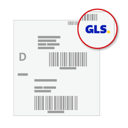

# WooGLS Labels 📦

WooGLS Labels, GLS Web API'si ile Paket İşleme ve Paket İptali için entegre olan ve GLS kargo etiketlerini doğrudan WordPress kontrol panelinizden oluşturmanızı sağlayan bir WordPress eklentisidir.

## 🔄 Uyumluluk

WooGLS Labels, PHP'nin 7.4 ile 8.3 sürümleri arasındaki sürümlerle uyumludur.

## 🌟 Özellikler

- GLS Web API'si ile Paket İşleme ve Paket İptali için entegrasyon.
- GLS kargo etiketleri ve iade etiketlerinin oluşturulması.
- Sipariş detayları sayfasında bir metabox ile kullanıcı dostu arayüz.
- Otomatik olarak siparişe konsinye numarası ve etiket için indirme linki içeren bir not ekler.
- İngilizce, Almanca ve Türkçe'ye çevrilmiştir.

## 📥 Kurulum

WooGLS Labelsni doğrudan WordPress yönetici panelinden kurabilirsiniz:

1. Eklentiler menüsüne gidin ve "Yeni Ekle"yi tıklayın.
2. "WooGLS Labels"ni arayın.
3. "Şimdi Kur"u ve ardından "Etkinleştir"i tıklayın.

Manuel kurulum için:

1. Eklentiyi indirin ve çıkarın.
2. Çıkarılmış klasörü WordPress eklenti dizininize (`/wp-content/plugins/`) yükleyin.
3. Eklentiyi WordPress kontrol paneli üzerinden etkinleştirin.

## 🚀 Kullanım

Eklentiyi etkinleştirdikten sonra, WordPress kontrol panelinize giderek "Ayarlar" -> "WooGLS Labels"ne giderek konfigüre edebilirsiniz. Burada GLS kullanıcı ID'nizi, şifrenizi, gönderici hesap numaranızı ve gönderici adresinizi girebilirsiniz.

Bir kargo veya iade etiketi oluşturmak için, sipariş sayfasına gidin ve GLS metabox'ta "Kargo Etiketi Oluştur" veya "İade Etiketi Oluştur"u tıklayın. Seçilen etiket oluşturulacak ve siparişe konsinye numarası ve etiket için indirme linki içeren bir not eklenecektir.

## 🙋 Destek

Destek ihtiyacınız varsa veya herhangi bir sorunuz varsa, lütfen GitHub depomuzda yeni bir sorun oluşturun.

## 📄 Lisans

Bu eklenti MIT lisansı altında lisanslanmıştır. Daha fazla bilgi için [LICENSE](LICENSE) bakınız.

## 🌐 Diğer Diller

- [English](README.md)
- [Deutsch](README-de_DE.md)
