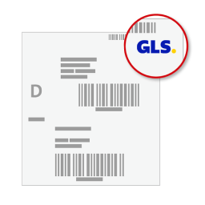

# WooGLS Labels 📦

The WooGLS Labels is a WordPress plugin that integrates with the GLS Web API for Parcel Processing and Parcel Cancellation, allowing the creation of GLS shipping labels directly from your WordPress dashboard.

## 🔄 Compatibility

The WooGLS Labels is compatible with PHP versions from 7.4 to 8.3.

## 🌟 Features

- Integration with GLS Web API for Parcel Processing and Parcel Cancellation.
- Creation of GLS shipping labels and return labels.
- User-friendly interface with a metabox in the order details page.
- Automatically adds a note to the order with the consignment number and a download link for the label.
- Translated into English, German, and Turkish.

## 📥 Installation

You can install the WooGLS Labels directly from the WordPress admin panel:

1. Go to the Plugins menu and click "Add New".
2. Search for "WooGLS Labels".
3. Click "Install Now" and then "Activate".

For manual installation:

1. Download the plugin and unzip it.
2. Upload the unzipped folder to your WordPress plugin directory (`/wp-content/plugins/`).
3. Activate the plugin via the WordPress dashboard.

## 🚀 Usage

After activating the plugin, you can configure it by going to your WordPress dashboard and navigating to "Settings" -> "WooGLS Labels". Here you can enter your GLS user ID, your password, your shipper number, and your shipper address.

To create a shipping or return label, go to the order page and click on "Create Shipping Label" or "Create Return Label" in the GLS metabox. The selected label will then be created, and a note will be added to the order with the consignment number and a download link for the label.

## 🙋 Support

If you need support or have any questions, please create a new issue in our GitHub repository.

## 📄 License

This plugin is licensed under the MIT. See [LICENSE](LICENSE) for more information.

## 🌐 Other Languages

- [Türkçe](README-tr_TR.md)
- [Deutsch](README-de_DE.md)
