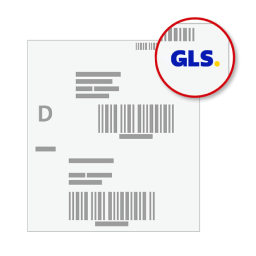

# GLS Labels 📦

Das GLS Labels ist ein WordPress Plugin, das sich mit der GLS Web API für Paketverarbeitung und Paketstornierung integriert und ermöglicht die Erstellung von GLS Versandetiketten direkt aus Ihrem WordPress Dashboard.

## 🔄 Kompatibilität

Das GLS Labels ist kompatibel mit PHP-Versionen von 7.4 bis 8.3.

## 🌟 Funktionen

- Integration mit der GLS Web API für Paketverarbeitung und Paketstornierung.
- Erstellung von GLS Versand- und Rücksendeetiketten.
- Benutzerfreundliche Oberfläche mit einer Metabox auf der Bestelldetailseite.
- Fügt automatisch eine Notiz zur Bestellung mit der Sendungsnummer und einem Download-Link für das Etikett hinzu.
- Übersetzt in Englisch, Deutsch und Türkisch.

## 📥 Installation

Sie können das GLS Labels direkt aus dem WordPress Admin-Panel installieren:

1. Gehen Sie zum Menü "Plugins" und klicken Sie auf "Neu hinzufügen".
2. Suchen Sie nach "GLS Labels".
3. Klicken Sie auf "Jetzt installieren" und dann auf "Aktivieren".

Für die manuelle Installation:

1. Laden Sie das Plugin herunter und entpacken Sie es.
2. Laden Sie den entpackten Ordner in Ihr WordPress Plugin-Verzeichnis (`/wp-content/plugins/`) hoch.
3. Aktivieren Sie das Plugin über das WordPress Dashboard.

## 🚀 Nutzung

Nach der Aktivierung des Plugins können Sie es konfigurieren, indem Sie zu Ihrem WordPress Dashboard gehen und zu "Einstellungen" -> "GLS Labels" navigieren. Hier können Sie Ihre GLS Benutzer-ID, Ihr Passwort, Ihre Versender-Kontonummer und Ihre Versender-Adresse eingeben.

Um ein Versand- oder Rücksendeetikett zu erstellen, gehen Sie zur Bestellseite und klicken Sie auf "Versandetikett erstellen" oder "Rücksendeetikett erstellen" in der GLS Metabox. Das ausgewählte Etikett wird dann erstellt und eine Notiz wird zur Bestellung hinzugefügt mit der Sendungsnummer und einem Download-Link für das Etikett.

## 🙋 Support

Wenn Sie Unterstützung benötigen oder Fragen haben, erstellen Sie bitte ein neues Issue in unserem GitHub Repository.

## 📄 Lizenz

Dieses Plugin ist unter der MIT lizenziert. Siehe [LICENSE](../LICENSE) für weitere Informationen.

## 🌐 Andere Sprachen

- [English](../README.md)
- [Türkçe](README-tr_TR.md)
